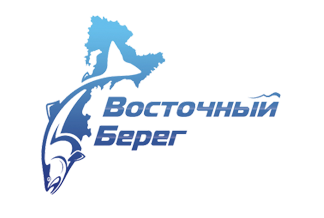
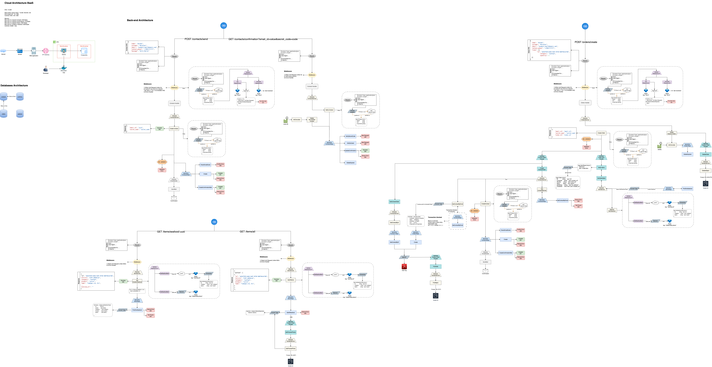

# ООО "Восточный Берег"
> Информация к официальному серверу компании.


## Установка

Установка проекта производится исключительно в рамках Docker контейнеров. 

```shell
    # В случае разработки
    docker compose -f docker-compose.dev.yml up
```

1) Первым делом запускается контейнер Базы Данных с health check (10 секунд);
2) Далее происходит запуск миграций;
3) После миграций мы наблюдаем запуск Redis контейнера;
4) Тут же запускается сервер разработки;


## Архитектура проекта

Файл в корне: E-cost.drawio.pdf




## Лицензия

"Код в этом проекте лицензирован на условиях лицензии MIT."